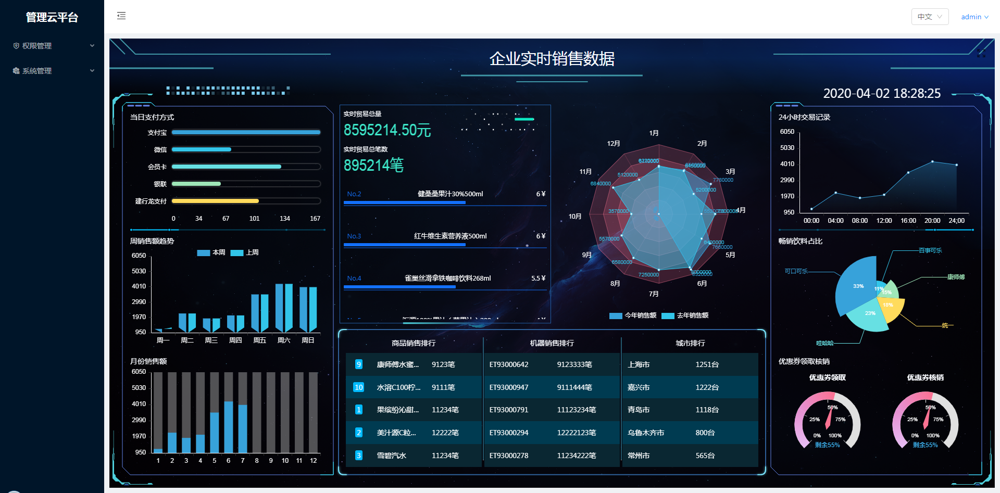
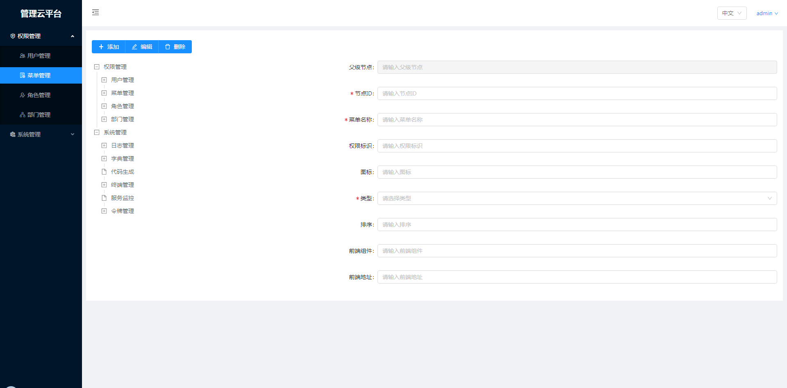
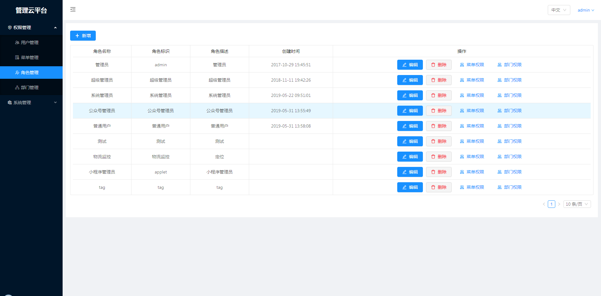
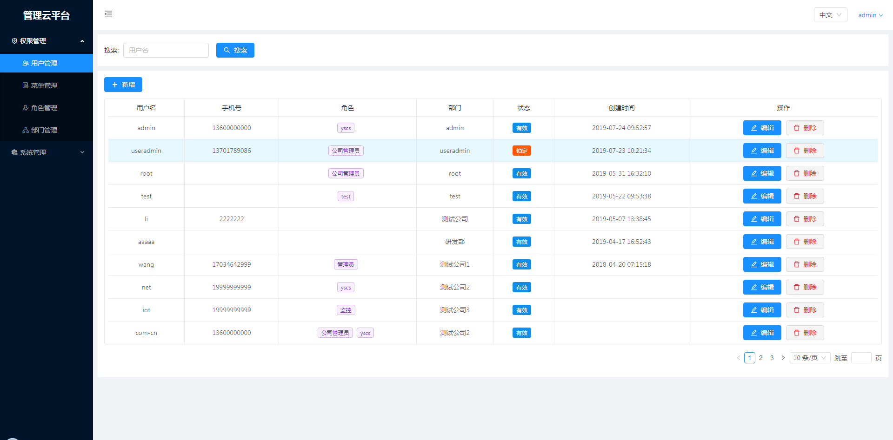
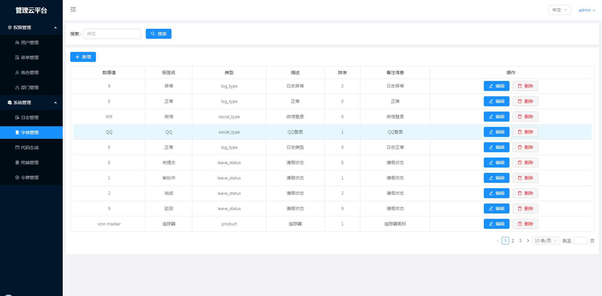

#### 技术栈
vue2 + vuex + vue-router + webpack + ES6/7 + axios + antd + 阿里图标iconfont

#### 说明

>  账号密码不为空即可

>  本项目主要用 vue2 架构一个后端管理平台项目

>  为了方便后期修改使用，模拟数据在页面中，具体修改看下面

>  开发环境 win7  Chrome 61


#### 目录结构
------------------------

```bash
├── /public/         # 公共文件
├── /src/            # 源码目录
│ ├── /api/          # 请求
│ ├── /assets/       # 组件静态资源(图片)
│ ├── /components/   # 公共组件
| ├── /languages/    # 多语言配置
| ├── /minxins/      # minxins
│ ├── /router/       # 路由配置
│ ├── /styles/       # 公共样式
│ ├── /views/        # 路由组件(页面维度)
│ ├── /utils/        # 公共方法
│ ├── App.vue        # 组件入口
│ └── main.js        # 程序入口
├── .babelrc         # ES6语法编译配置
├── .editorconfig    # 定义代码格式
├── .eslintignore    # ES6规范忽略文件
├── .eslintrc.js     # ES6语法规范配置
├── .gitignore       # git忽略文件
├── package.json     # 项目依赖
└── README.md        # 项目文档
```

#### 数据

项目请求已经改为假数据，例如：
``` bash

数据为mock模拟数据
列表获取功能可用，修改删除功能已开发完成，需和后台对接相应字段即可

```


#### 部分截图

首页


菜单


角色


用户


字典



#### 运行项目
```
yarn install
```

### Compiles and hot-reloads for development
```
yarn serve
```

### Compiles and minifies for production
```
yarn build
```

### Lints and fixes files
```
yarn lint
```

#### 项目源码地址：
------------------------

源码地址：https://github.com/jaysleo/vue-antd
